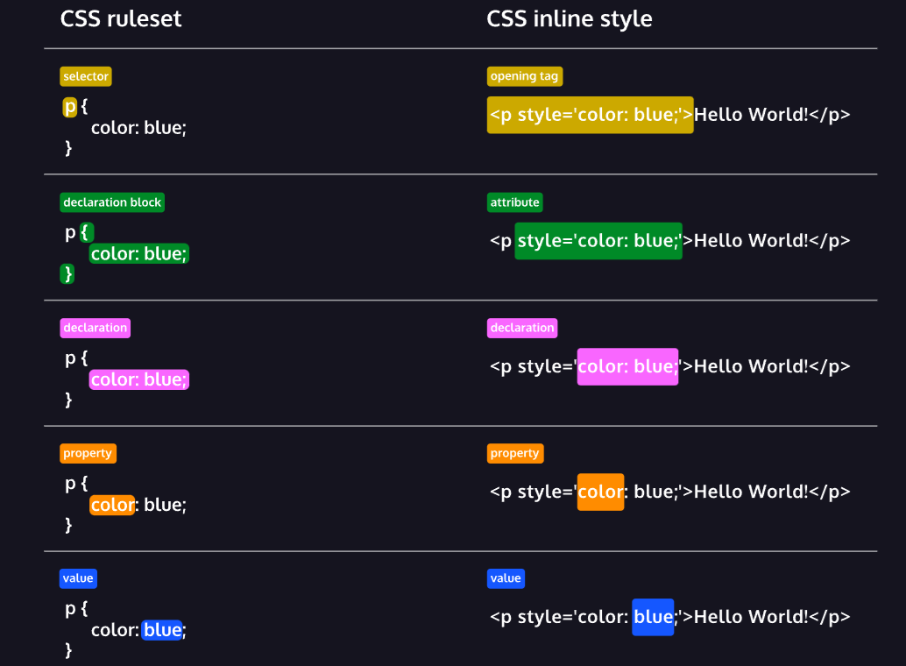

Lesson Link:

https://www.codecademy.com/journeys/full-stack-engineer/paths/fscj-22-web-development-foundations/tracks/fscj-22-fundamentals-of-css/modules/wdcp-22-learn-css-selectors-and-visual-rules-0507dd23-134e-4011-af2c-a06b06ad53f2/lessons/learn-css-setup-and-syntax/exercises/css-anatomy

### SETUP AND SYNTAX

## CSS Anatomy

The diagram on the right shows two different methods, or syntaxes, for writing CSS code. The first syntax shows CSS applied as a ruleset, while the second shows it written as an inline style. Two different methods of writing CSS may seem a bit intimidating at first, but it’s not as bad as it looks!

Both methods contain common features in their anatomy. Notice how both syntaxes contain a declaration. Declarations are the core of CSS. They apply a style to the selected element. Here, the 
 element has been selected in both syntaxes and will be styled to display the text in blue.

Understanding that a declaration is used to style a selected element is key to learning how to style HTML documents with CSS! The terms below explain each of the labels in the diagram on the right.

Ruleset Terms:

- Selector—The beginning of the ruleset used to target the element that will be styled.
- Declaration Block—The code in-between (and including) the curly braces ({ }) that contains the CSS declaration(s).
- Declaration—The group name for a property and value pair that applies a style to the selected element.
- Property—The first part of the declaration that signifies what visual characteristic of the element is to be modified.
- Value—The second part of the declaration that signifies the value of the property.

Inline Style Terms:

- Opening Tag—The start of an HTML element. This is the element that will be styled.
- Attribute—The style attribute is used to add CSS inline styles to an HTML element.
- Declaration—The group name for a property and value pair that applies a style to the selected element.
- Property—The first part of the declaration that signifies what visual characteristic of the element is to be modified.
- Value—The second part of the declaration that signifies the value of the property.

Don’t worry about memorizing all of these—you will get acquainted with them more and more as the course progresses! Feel free to come back and use this exercise as a reference later on.

### Instructions

Study the diagrams to become familiar with the CSS syntax and the new terms that will be used throughout the course.

Click the “Next” button when you are ready to write some code!

